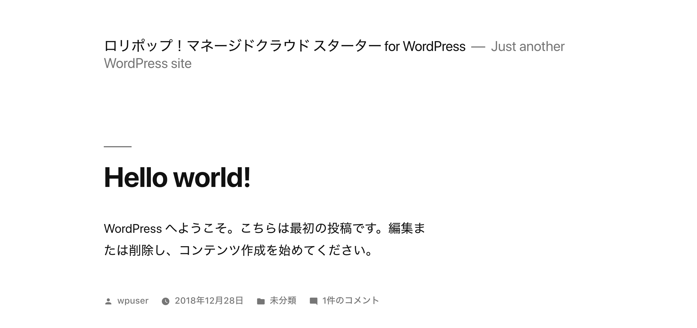

# ロリポップ！マネージドクラウド スターター for WordPress

https://ja.wordpress.org/

## インストールバージョン

latest

### 0. 事前準備

1. [ロリポップ！マネージドクラウド](https://mc.lolipop.jp)でアカウントを作成
2. SSH公開鍵の追加と設定済み

### 1. ロリポップ！マネージドクラウドで新規プロジェクトを作成

PHP 7.2.12

### 2. インストール

``` console
$ make install
```

### 3. セットアップ完了


